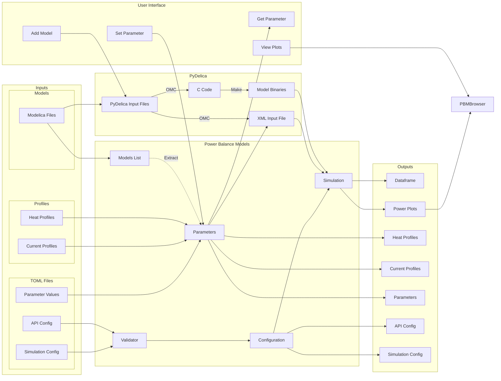

# Power Balance Models API

## Overview

- The Application Programming Interface (API) provides commands for accessing features within Power Balance Models (PBM). The core part of the API is the `PowerBalance` class which holds session properties such as the model list and model parameters.
- Parameters can be set manually by the user within scripts, are read from input parameter files or default values are used.

- The interaction with Modelica source files is handled by [PyDelica](https://pypi.org/project/pydelica/) which is itself an API to the OpenModelica Compiler (OMC).

- When a model run is completed copies of the inputs are stored alongside the output data for reproducibility.

## PyDelica
PBM uses PyDelica to compile, configure and run a Modelica model. At its base the process consists of five main steps:

- Create a PyDelica session and hand it the Modelica files for the models required.
- The models will firstly be converted into C source files and relevant build files.
- The model will then be compiled using the created Makefile.
- As compiled models rely on a created XML file to set initial parameter values, PyDelica allows the user to set these conditions by modifying this XML file directly.
- Run the binary when a simulation is requested.

??? question "Why not OMPython?"
    For those who have researched the topic you will already know that OpenModelica already comes with a Python interface, [OMPython](https://openmodelica.org/doc/OpenModelicaUsersGuide/latest/ompython.html). However rather than being a direct API for OpenModelica itself, it acts as an API for OMShell which in turn runs OpenModelica. In order to do this it has to run on a server (i.e. ZMQ session). Whilst writing Unit Tests for Power Balance Models using OMPython it was discovered that this server approach is very taxing on CPU especially when you want to run multiple models in tandem as each would create a new OMC session. 
    
    When OMC is run in script generation mode an XML file is also created from which the compiled binary reads parameter values and simulation options. As Python is able to edit XML files PyDelica instead updates parameter values directly.

    Furthermore OMPython does not throw exceptions when the OpenModelica backend fails, instead the errors are largely lost or not even returned meaning any scripts continue to run even after model compilation/run failure.

## Validation
In the case of the [API configuration](configuration.md), [simulation configuration](simulation_opts.md) and [plasma scenario](plasma.md) files a validation check is performed on the inputs. These checks are performed using the [pydantic](https://pydantic-docs.helpmanual.io/) Python module which compares the inputs to a defined schema containing rules. Further information these schemas can be found [here](validation.md).
