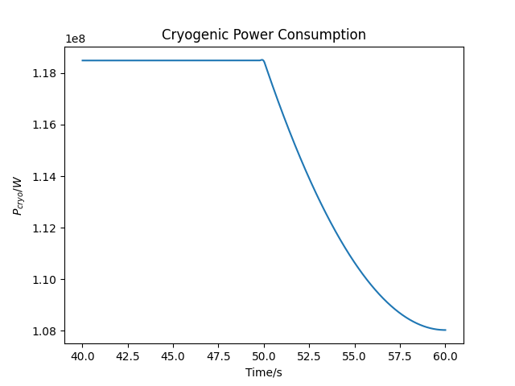

# Data Output

Results of power generation and consumption modelling are saved to a dataframe object for each model executed. These data frames are stored to a Hierarchical Data Format 5 (HDF5) file which has the advantage of allowing for metadata to be saved alongside numerical values.

The data frames can be easily retrieved using the Python module `pandas`, and provide a quick and easy way to perform analysis allowing the analyser to apply cuts to extract subsets they are interested in. This data format can also be loaded into other languages including R.

Each dataframe is stored under a key matching its lower case name with `.` replaced by `_`, e.g. `Tokamak.Interdependencies` $\rightarrow$ `tokamak_interdependencies`.

??? tip "iPython"
    The Python module `ipython` provides an interactive Python session which has more features than the conventional Python prompt including better command history preservation. It is recommended for quickly checking a HDF5 output on the fly.

??? example "Example: Plotting Cryogenic Power Consumption in the last 20 seconds"
    As a case study, let us say we are only interested in the power consumption of the Cryogenic system ($P_{cryo}$) at $40 \lt t \leq 60$s.

    ```python
    import pandas as pd
    import matplotlib.pyplot as plt
    import os

    from typing import Tuple

    def plot_pcryo(data_frame: pd.DataFrame, time_interval: Tuple[int, int]) -> None:
        """Plot Cryogenic power consumption within a time interval

        Parameters
        ----------
        data_frame: pandas.DataFrame
            dataframe to plot
        time_interval: Tuple[int, int]
            time range as tuple
        """
        # Apply cut to dataframe, could apply in one step but lets
        # do it in two for tidyness. Here we apply a cut to the 'time' variable
        _sub_df = data_frame[ data_frame['time'] > time_interval[0] ] # t1 < t
        _sub_df = _sub_df[ _sub_df['time'] <= time_interval[1] ]      # t1 < t <= t2

        # Now we can just directly specify which columns we want to plot X-Y
        plt.plot( _sub_df['time'], _sub_df['cryogenicpower'] )
        plt.xlabel('Time/s')
        plt.ylabel('$P_{cryo}/W$')
        plt.title('Cryogenic Power Consumption')
        plt.show()
    
    if __name__ in "__main__":
        # System path to output HDF5 file
        _file_path = 'pbm_results_2021_03_24_10_07_30/data/session_data.h5'

        # Key for model in file
        _df_key = 'tokamak_interdependencies'

        # Read the dataframe from the given file
        _data_frame = pd.read_hdf( _file_path, key=_df_key )

        plot_pcryo( _data_frame, (40, 60) )
    ```
    

??? tip "HDF5 browser"
    There are many applications and utilities that let you browse HDF5 files, some of these include:

    - `hdf5dump`: a CLI tool which is part of HDF5 tools.
    - [HDFCompass](https://support.hdfgroup.org/projects/compass/): GUI based browser. 